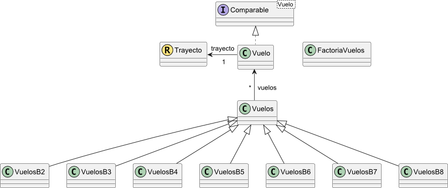

# Fundamentos de Programación
# Ejercicio de teoría: Vuelos

**Autor:** José C. Riquelme 
**Revisores:**  Toñi Reina, Mariano González. 
**Última modificación:** 03/04/2025.

# **1 Objetivos**

En este proyecto se trabajan de forma gradual en dificultad todos los conceptos vistos a lo largo de la asignatura. Como se van a implementar muchas funcionalidades en cada bloque de ejercicios, se va a definir una clase contenedora *Vuelos*, cuya descripción se presenta en el [BLOQUE01.md](./BLOQUE01.md). En el resto de los bloques se definirán clases contenedoras *VuelosB2*, *VuelosB3*, ... que extenderán a *Vuelos* con distintas funcionalidades, tal y como se muestra en el diagrama de clases que se presenta a continuación. Esto no es aconsejable en un proyecto real, pero se va seguir esta estructura con objeto de agrupar y organizar los ejercicios.





## **2 Datos disponibles**

En este proyecto trabajaremos con datos sobre vuelos que están disponibles en un archivo csv. A continuación se muestran las primeras líneas del fichero de datos.

```
origen;destino;precio;numpasaje;numplazas;codigo;fecha;duracion;tripulantes
Madrid;Barcelona;55.75;98;140;IB100;01/06/2023;75;PP0003,CP0004,AV0015,AV0006,AV0007
Barcelona;Madrid;65.50;112;140;IB101;01/06/2023;75;PP0001,CP0006,AV0013,AV0014,AV0025,AV0026	
Madrid;Valencia;45.25;100;100;RY200;01/06/2023;85;PP0005,CP0002,AV0017,AV0008,AV0019,AV0011		
Valencia;Madrid;50.00;90;100;RY201;02/06/2023;85;PP0001,CP0007,AV0014,AV0011,AV0025
Madrid;Paris;120.00;80;90;AF300;02/06/2023;120;PP0004,CP0002,AV0015,AV0014,AV0017,AV0008,AV0021		
Paris;Madrid;110.50;85;90;AF301;03/06/2023;120;PP0007,CP0004,AV0019,AV0020,AV0021		
```

## EJERCICIOS

Cree los paquetes `fp.aeropuerto` para albergar los tipos que debe implementar en los distintos ejercicios y `fp.aeropuerto.test` para las clases de test de los tipos correspondientes.

### **BLOQUE 0**

En este primer bloque se define el tipo base **Vuelo** con la siguiente descripción:

**Propiedades:**

- **trayecto:** de tipo *Trayecto* con el trayecto del vuelo. Consultable y modificable.
- **precio:** de tipo *Double* con el precio del vuelo. Consultable y modificable.
- **num pasajeros:** de tipo *Integer* con el número de pasajeros del vuelo. Consultable y modificable.
- **num plazas:** de tipo *Integer* con el número de plazas disponibles para pasajeros. Consultable y modificable.
- **codigo:** de tipo *String* con el código del vuelo. Consultable y modificable.
- **fecha:**  de tipo *LocalDate*, con la fecha de salida del vuelo. Consultable y modificable.
- **duracion:**  de tipo *Duration*, con la duración del vuelo. Consultable  y modificable.
- **tripulacion:** de tipo *List\<String\>*, con los códigos de la tripulación del vuelo. Estos códigos están formados por 6 caracteres, de los cuales los dos primeros son alfabéticos (en mayúsculas) y los cuatro siguientes numéricos. Los pilotos empiezan por las iniciales PP, los copilotos por CP, y los auxiliares de vuelo por AV. Consultable. 
- **origen:** de tipo *String*. Se obtiene a partir del origen del trayecto.
- **destino:** de tipo *String*. Se obtiene a partir del destino del trayecto.
- **duracion minutos**: de tipo *Integer*. Se obtiene a partir de la duración del vuelo.
- **esta completo**: de tipo *Boolean*. Es *true* si no hay plazas disponibles.
- **porcentaje ocupacion**: de tipo *Double*. Se obtiene como el porcentaje de plazas ocupadas por los pasajeros en relación al número de plazas disponibles.

**Constructor:**

- **C1**: Crea un objeto tomando como parámetros las propiedades básicas del mismo, en el orden en el que se describen arriba.

**Restricciones:**

- **R1**: El número de plazas debe ser mayor que cero.
- **R2**: El número de pasajeros debe ser mayor o igual que cero.
- **R3**: El precio debe ser mayor o igual que cero.
- **R4**: El número de pasajeros debe inferior o igual que el número de plazas.
- **R5**: El número de tripulantes del avión debe ser superior o igual a 3 (un piloto, un copiloto y al menos un auxiliar).
- **R6**: Los códigos de los tripulantes del avión deben tener 6 caracteres, los dos primeros deben ser alfabéticos (en mayúsculas) y los cuatro últimos numéricos. 
- **R7**: Una tripulación debe tener al menos un piloto, un copiloto y un asistente. 


**Representación como cadena:**

- El trayecto, seguido del código y la fecha.

**Criterio de igualdad:**

- Dos objetos de tipo **Vuelo** son iguales si lo son su código y la fecha.

**Criterio de ordenación:**

- Por fecha y, a igualdad de fecha, por código.

**Otras operaciones:**

- *void incrementaPrecioPorcentaje(Double porcentaje)*: Dado un porcentaje, incrementa el precio del vuelo en el porcentaje dado como parámetro.

Implemente el tipo **Vuelo** como una clase, y el tipo **Trayecto** como un *record* con la siguiente descripción:

**Propiedades:**

- **origen:** de tipo *String*. Origen del trayecto.
- **destino:** de tipo *String*. Destino del trayecto.

**Constructor:**

- **C1**: Crea un objeto tomando como parámetros las propiedades básicas del mismo, en el orden en el que se describen arriba.

**Restricciones:**

- **R1**: El origen del trayecto no puede ser el mismo que el destino.

**Representación como cadena:**

- Representación por defecto de los *record*.

**Criterio de igualdad:**

- Dos objetos de tipo **Trayecto** son iguales si lo son todas sus propiedades.


### **BLOQUE 1**

El objetivo de este bloque es implementar un tipo contenedor y una factoría para el tipo contenedor. La descripción de los ejercicios de este bloque se encuentra en el archivo [BLOQUE01.md](./BLOQUE01.md).

### **BLOQUE 2**

El objetivo de este bloque es implementar tratamientos secuenciales con bucles. La descripción de los ejercicios de este bloque se encuentra en el archivo [BLOQUE02.md](./BLOQUE02.md).

### **BLOQUE 3**

El objetivo de este bloque es implementar tratamientos secuenciales con bucles para trabajar con `SortedSet`, `Map` y `SortedMap`. La descripción de los ejercicios de este bloque se encuentra en el archivo [BLOQUE03.md](./BLOQUE03.md).

### **BLOQUE 4**

El objetivo de este bloque es implementar tratamientos secuenciales con *stream* sencillos [BLOQUE04.md](./BLOQUE04.md).

### **BLOQUE 5**

El objetivo de este bloque es trabajar con tratamientos secuenciales con varios pasos y *collectors* para crear Maps sencillos [BLOQUE05.md](./BLOQUE05.md).


### **BLOQUE 6**

El objetivo de este bloque es trabajar con tratamientos secuenciales con varios pasos y *collectors* para crear Maps de nivel medio de dificultad [BLOQUE06.md](./BLOQUE06.md).

### **BLOQUE 7**

El objetivo de este bloque es trabajar con tratamientos secuenciales con varios pasos y *collectors* para crear Maps de nivel medio/alto de dificultad [BLOQUE07.md](./BLOQUE07.md).

### **BLOQUE 8**

El objetivo de este bloque es trabajar con tratamientos secuenciales con varios pasos y *collectors* para crear Maps de nivel medio/alto de dificultad [BLOQUE08.md](./BLOQUE08).

